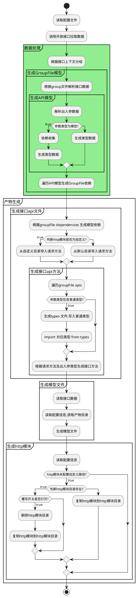

### fast-api

基于apifox开放接口文档，自动生成接口请求、接口文档、TypeScript 类型定义文件

#### 配置文件
**configOptions** 配置可参考[apifox开放接口文档](https://apifox-openapi.apifox.cn/api-173411997)配置

```javascript
{
  version?: string; //default 2024-03-28
  Authorization: string; // apifox authorization
  projectId: string; // 需要生成的项目id
  configOptions: IConfigOptions;
  input?: {
    // http 入口文件 需对外暴露get post 不传则去模版生成
    httpFilePath?: string;
  };
  output?: {
    // 模型文件目录 default  /src/services/modal
    modalDir?: string;
    // 接口文件目录 default /src/services/apis
    apiDir?: string;
  };
}

```


